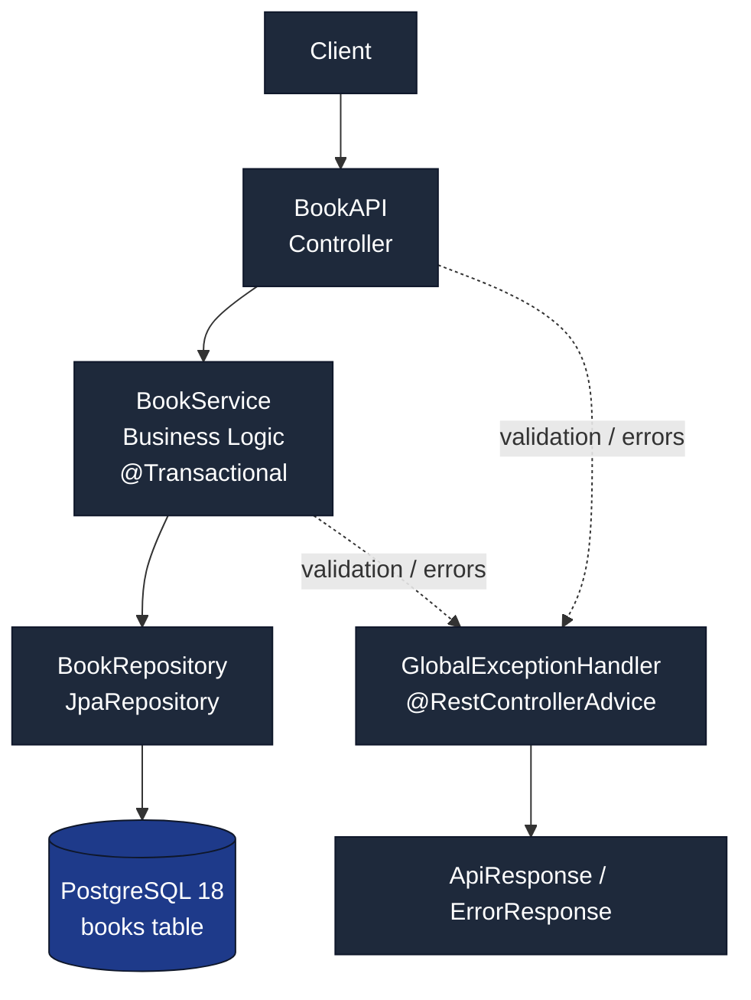
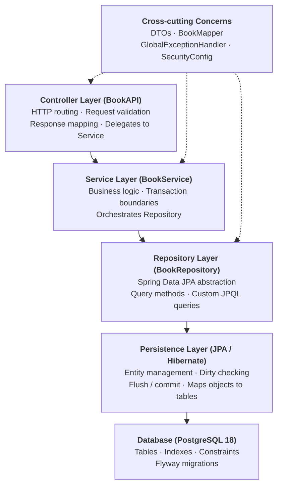

<h1 align="center">Libro - Library Management System</h1>

<p align="center">
  
</p>


Libro is a Spring Boot REST API and Library Management System. It manages books with CRUD operations, search, pagination, sorting, range filtering, genre analytics, and statistics. It also contains a user-domain foundation, while user and loan HTTP APIs are not yet exposed. The prototype uses DTO-driven validation, centralized exception handling, and a Docker-first workflow backed by PostgreSQL 18 with Flyway database migrations.

The institutional context behind the user domain is documented in [Institutional Context](docs/institutional-context.md), including its ASU-CCS setting and alignment with existing MIS identity conventions.

The API exposes generated OpenAPI documentation through Springdoc. Swagger UI is available at `/swagger-ui.html` and the machine-readable specification is available at `/v3/api-docs` when the application is running. The live specification includes request validation rules, filter and sorting constraints, pagination behavior, and representative request/response examples for the book API.

## Tech Stack

| Layer | Technology / Framework |
| --- | --- |
| Language | Java 25 |
| Framework | Spring Boot 4.1.0 (Web, Data JPA, Security, Validation) |
| Database | PostgreSQL 18 |
| Migrations | Flyway 13.3.0 |
| Containerization | Docker & Docker Compose |
| Build Tool | Maven 3.x |
| Code Generation | Lombok 1.18.46 |
| Testing | JUnit 5, Mockito, JaCoCo |
| Serialization | Jackson (JSON) |
| Validation | Jakarta Bean Validation |
| Logging | SLF4J via Lombok `@Slf4j` |

## Table of Contents

* [Architecture Overview](https://github.com/kyledelfin2006/library-api-system#architecture-overview)
* [Layered Design](https://github.com/kyledelfin2006/library-api-system#layered-design)
* [File Structure](https://github.com/kyledelfin2006/library-api-system#file-structure)
* [Core Design Patterns](https://github.com/kyledelfin2006/library-api-system#core-design-patterns)
* [Key Features](https://github.com/kyledelfin2006/library-api-system#key-features)
* [Request Lifecycle](https://github.com/kyledelfin2006/library-api-system#request-lifecycle)
* [Code Highlights](https://github.com/kyledelfin2006/library-api-system#code-highlights)
* [API Endpoints](https://github.com/kyledelfin2006/library-api-system#api-endpoints)
* [Setup & Installation](https://github.com/kyledelfin2006/library-api-system#setup--installation)
* [Troubleshooting](https://github.com/kyledelfin2006/library-api-system#troubleshooting)
* [Data Management](https://github.com/kyledelfin2006/library-api-system#data-management)
* [Testing](https://github.com/kyledelfin2006/library-api-system#testing)
* [Documentation](#documentation)
* [Development Problems Solved](#development-problems-solved)
* [Upcoming Improvements](https://github.com/kyledelfin2006/library-api-system#upcoming-improvements)
* [License](https://github.com/kyledelfin2006/library-api-system#license)

## Documentation

The README is the central entry point for project documentation. Supporting reports belong in `docs/`, while files that rely on repository-root discovery remain at the root.

- [Development Problems Solved](docs/development-problems-solved.md) is a first-person development reflection covering the major bugs, effects, fixes, and verification decisions made while building the prototype.
- [Institutional Context](docs/institutional-context.md) records the ASU-CCS academic model and the existing MIS assumptions that shaped the user domain.
- [Agent and Contributor Guide](AGENTS.md) documents the repository architecture, layer contracts, coding rules, testing expectations, and definition of done. It remains at the repository root so coding agents can discover it automatically.

## Architecture Overview

The application follows a strict **layered architecture** where each layer has a single responsibility and communicates only with adjacent layers.



### Layered Design



## File Structure

```text
AGENTS.md
README.md
docs/
  development-problems-solved.md

src/main/java/app/
  LibraryApplication.java
  auth/
    SecurityConfig.java
  book/
    controller/
      BookAPI.java
    service/
      BookService.java
    repository/
      BookRepository.java
      projection/
        GenreCount.java
        LibraryAggregate.java
    entity/
      Book.java
    dto/
      BookRequestDTO.java
      BookResponseDTO.java
      LibraryStatisticsDTO.java
    mapper/
      BookMapper.java
    exceptions/
      BookNotFoundException.java
    global/
      exceptions/
        GlobalExceptionHandler.java
      responses/
        ApiResponse.java
        ErrorResponse.java
  user/
    beans/PasswordConfig.java
    dto/
      ChangePasswordDTO.java
      UserCreateRequestDTO.java
      UserCreateUpdateDTO.java
      UserResponseDTO.java
    entity/
      User.java
      enums/
        UserCourse.java
        UserITMajor.java
        UserRole.java
    mapper/UserMapper.java
    repository/UserRepository.java
    exception/UserNotFoundException.java
    service/UserService.java

src/main/resources/
  application.properties
  db/
    migration/
      V1__create_books_table.sql
      V2__create_users_table.sql

src/test/java/
  unit/
    BookApiMvcTest.java
    BookMapperTest.java
    BookTest.java
    BookServiceTest.java
    GlobalExceptionHandlerTest.java

src/test/resources/
  junit-platform.properties
  logback-test.xml
```

## Core Design Patterns

- **Layered Architecture** keeps HTTP, business, and persistence concerns separate and testable.
- **DTO-based request handling** protects the entity model and keeps validation at the boundary.
- **Transactional service methods** rely on Hibernate dirty checking, so updates are flushed automatically when the managed entity changes.
- **Centralized exception handling** ensures consistent JSON failures across validation, not-found, database, and parsing errors.
- **Repository abstraction** through Spring Data JPA keeps persistence code small and expressive.
- **Typed repository projections** give aggregate queries named fields instead of positional `Object[]` values. `LibraryAggregate` and `GenreCount` are internal immutable projections; public endpoints retain their existing DTO/map response shapes.
- **Mapper pattern** centralizes entity-DTO conversion to avoid duplication across controllers and services.
- **Flyway migrations** version the database schema alongside application code.

## DTO-Wrapped Entity Models

The application never exposes `Book` (or future entity) objects directly to clients. All inbound data is wrapped in request DTOs, and all outbound data is wrapped in response DTOs.

### Rules

- **Never** instantiate an entity directly from client input.
- **Never** return an entity directly in a controller response.
- Controllers always accept `BookRequestDTO` and return `BookResponseDTO` (or other DTOs).
- `BookMapper` is the sole conversion point between entities and DTOs.

### Why This Matters

1. **Decouples the entity model from the client-facing API**
   The database schema can evolve independently of the API contract. If a column is renamed or removed in the database, only the mapper and entity need to change; the JSON contract stays stable.

2. **Ties the entity model only to the database**
   Entities represent persistence state, not API state. This keeps JPA/Hibernate concerns isolated and prevents accidental leakage of database-only fields (e.g., audit timestamps, soft-delete flags) into API responses.

3. **Prevents accidental data leaks**
   Response DTOs explicitly choose which fields are exposed. Sensitive or internal fields never appear in JSON unless intentionally added to the response DTO.

4. **Enforces request validation at the boundary**
   `BookRequestDTO` carries Jakarta Validation annotations (`@NotBlank`, `@Size`, `@NotNull`, `@Positive`). `@Valid` in the controller triggers these constraints before any business logic runs, ensuring only valid data reaches the service layer.

5. **Allows response customization**
   Response DTOs can reshape, rename, compute, or omit fields without changing the entity. For example, `LibraryStatisticsDTO` aggregates data from multiple repository calls into a single read-only snapshot.

### Example

```java
// Controller accepts only the request DTO
@PostMapping("/add")
public ResponseEntity<ApiResponse<BookResponseDTO>> addBook(@Valid @RequestBody BookRequestDTO input) {
    Book newBook = service.addBook(input);           // DTO -> Entity inside service/mapper
    return ResponseEntity.status(HttpStatus.CREATED)
            .body(new ApiResponse<>(true, "Book Added Successfully", mapper.toResponseDTO(newBook)));
}
```

## Key Features

- CRUD operations for books.
- Duplicate titles and authors are allowed because books are identified by generated IDs; the model does not yet include an ISBN or edition key.
- Pagination and sorting through `GET /app/books/all` and `GET /app/books/sorted`.
- Advanced search by title, author, genre, or price.
- Price range filtering through `GET /app/books/price`.
- Budget filtering through `GET /app/books/budget`.
- Statistics endpoints for total books, total library value, average price, and the most expensive book.
- Genre distribution endpoint.
- User-domain foundation with role/course/major enums, duplicate checks, academic business rules, and BCrypt password hashing; passwords require 8–72 characters with uppercase and lowercase letters, a number, and a symbol. No user controller exists yet.
- OpenAPI 3 documentation through Springdoc Swagger UI and `/v3/api-docs`.
- Validation with `@Valid` on create and replace requests.
- Global handling for `BookNotFoundException`, validation errors, malformed JSON, number format errors, database issues, and unsupported methods.
- Open security configuration for local development and testing.
- Versioned database schema via Flyway.

## Request Lifecycle

### Create flow (`POST /app/books/add`)

1. Client sends a JSON payload to `/app/books/add`.
2. `BookAPI` receives the request and binds it to `BookRequestDTO`.
3. `@Valid` triggers Jakarta Validation on the DTO.
4. On success, `BookService.addBook()` converts the DTO to an entity via `BookMapper`.
5. `BookRepository.save()` persists the entity and returns the generated ID.
6. The controller maps the saved entity to `BookResponseDTO` and returns `201 Created`.

### Update flow (`PATCH /app/books/{id}`)

1. The controller passes the incoming DTO to `BookService.patchBook()`.
2. The service loads the managed `Book` entity via `findBookById()`.
3. Field changes are applied conditionally to the managed entity.
4. Hibernate dirty checking detects the modifications.
5. The transaction commits and flushes the update without an explicit `save()` call.

### Startup flow

1. Compose waits until PostgreSQL passes `pg_isready`.
2. Spring Boot starts `app.LibraryApplication`.
3. The Spring Boot Flyway starter runs pending migrations before JPA initializes.
4. Hibernate validates the migrated schema with `ddl-auto=validate`.
5. `SecurityConfig` allows all requests and disables CSRF.
6. The API becomes ready at `http://localhost:8080`.

## Code Highlights

### DTO validation on create

```java
@PostMapping("/add")
public ResponseEntity<ApiResponse<BookResponseDTO>> addBook(@Valid @RequestBody BookRequestDTO input) {
    Book newBook = service.addBook(input);
    return ResponseEntity.status(HttpStatus.CREATED)
            .body(new ApiResponse<>(true, "Book Added Successfully", mapper.toResponseDTO(newBook)));
}
```

### Partial Updates: PUT vs PATCH Design

The API deliberately distinguishes **full replacement (PUT)** from **partial updates (PATCH)** through a validation strategy that prevents the two most common mistakes in REST partial-update implementations.

#### Architectural Decision

`BookRequestDTO` is reused for both PUT and PATCH. The distinction between "replace everything" and "change only what's sent" is expressed through where validation is applied:

| Dimension | `PUT /app/books/{id}` (replace) | `PATCH /app/books/{id}` (partial) |
|---|---|---|
| Controller annotation | `@Valid @RequestBody BookRequestDTO` | `@RequestBody BookRequestDTO` (no `@Valid`) |
| Omitted fields | Rejected — all `@NotBlank`/`@NotNull` constraints fire | Skipped — `null` means "leave unchanged" |
| Empty strings | Rejected — `@NotBlank` fails on `""` | Skipped — `hasText()` treats `""` as absent |
| Price `null` | Rejected — `@NotNull` fails | Skipped — only validated when non-null |
| Price ≤ 0 | Rejected — `@Valid` + `@Positive` | Rejected — manual `compareTo` check in service |
| Validation layer | DTO annotations (primary) + service guards (defense-in-depth) | Service-level field-by-field conditional logic |

#### Problems Solved

1. **Applying PUT rules to PATCH breaks partial updates entirely.** If `@Valid` were on the PATCH endpoint, sending `{"price": 15.99}` would fail because `title`, `author`, and `genre` arrive as `null` and violate `@NotBlank`. The request is semantically correct for a partial update, but annotation validation rejects it. The solution is omitting `@Valid` on PATCH so null fields pass through unvalidated, then validating only the fields that are actually present.

2. **Applying PATCH rules to PUT allows silent data corruption.** If PUT used the same `hasText()` skip pattern (`if (hasText(dto.getTitle())) { existing.setTitle(dto.getTitle()); }`), a client could PUT `{"title": null, "author": "Orwell", "genre": "Drama", "price": 10.00}` and the `null` title would be silently ignored, leaving the old title in place. This violates the "complete replacement" contract of PUT. The solution is applying `@Valid` on PUT so every field is required and validated, plus redundant service-level checks as defense-in-depth for non-HTTP callers.

3. **Empty strings vs. null are both treated as "no update" on PATCH.** The `hasText()` helper (`s != null && !s.trim().isEmpty()`) ensures `"title": ""` and `"title": "   "` are treated identically to `"title": null` during a partial update. This prevents clients from accidentally blanking a field with an empty string, which would otherwise overwrite valid persisted data with an empty value. On PUT, both cases are rejected by `@NotBlank`.

#### Dirty-Checking Optimization

Neither `patchBook` nor `replaceBook` calls `repository.save()` on the fetched entity. Both are `@Transactional`, so the persistence context keeps the entity managed, and Hibernate's dirty checker automatically detects field changes and flushes the required SQL `UPDATE` at commit. This avoids an unnecessary explicit save call and prevents accidental overwrites of the `createdAt` timestamp.

```java
@Transactional
public Book patchBook(Long id, BookRequestDTO updates) {
    Book existingBook = findBookById(id);
    if (hasText(updates.getTitle())) {
        existingBook.setTitle(updates.getTitle().trim());
    }
    if (updates.getPrice() != null) {
        if (updates.getPrice().compareTo(BigDecimal.ZERO) <= 0) {
            throw new BookValidationException("Price must be greater than 0");
        }
        existingBook.setPrice(updates.getPrice());
    }
    return existingBook;
}
```

### Centralized API errors

```java
@ExceptionHandler(BookNotFoundException.class)
public ResponseEntity<ErrorResponse> handleBookNotFound(BookNotFoundException ex) {
    ErrorResponse error = new ErrorResponse("Book not found", ex.getMessage(), 404);
    return ResponseEntity.status(HttpStatus.NOT_FOUND).body(error);
}
```

### Statistics aggregation

```java
public LibraryStatisticsDTO getLibraryStatistics() {
    LibraryAggregate aggregate = repository.getCountAndTotalValue();
    Book mostExpensive = repository.findTopByOrderByPriceDesc();
    BookResponseDTO mostExpensiveDTO = (mostExpensive != null) ? mapper.toResponseDTO(mostExpensive) : null;
    return new LibraryStatisticsDTO(
            aggregate.totalBooks(),
            aggregate.totalValue(),
            mostExpensiveDTO
    );
}
```

`LibraryAggregate` and `GenreCount` are internal immutable repository projections. They keep count, total-value, and genre-distribution queries type-safe while `LibraryStatisticsDTO` and the genre endpoint's `Map<String, Long>` remain the public API response models.

## API Endpoints

| Method | Path | Description | Example Request | Example Response |
| --- | --- | --- | --- | --- |
| `GET` | `/app/books/health` | Health check for the API | `GET /app/books/health` | `{"success":true,"message":"Health check","data":{"api":true,"database":true},"timestamp":172...}` |
| `GET` | `/app/books/all` | Returns a paginated list of books | `GET /app/books/all?page=0&size=12&sort=id,asc` | `{"content":[{"id":1,"title":"1984","author":"George Orwell","genre":"Dystopian","price":19.99}],"pageable":{...}}` |
| `GET` | `/app/books/{id}` | Fetches a single book by ID | `GET /app/books/1` | `{"id":1,"title":"1984","author":"George Orwell","genre":"Dystopian","price":19.99}` |
| `POST` | `/app/books/add` | Creates a new book using `BookRequestDTO` validation | `POST /app/books/add` with `{"title":"1984","author":"George Orwell","genre":"Dystopian","price":19.99}` | `{"success":true,"message":"Book Added Successfully","data":{"id":1,"title":"1984","author":"George Orwell","genre":"Dystopian","price":19.99},"timestamp":172...}` |
| `PATCH` | `/app/books/{id}` | Partially updates a book | `PATCH /app/books/1` with `{"price":15.99}` | `{"success":true,"message":"Book updated successfully","data":{"id":1,"title":"1984","author":"George Orwell","genre":"Dystopian","price":15.99},"timestamp":172...}` |
| `PUT` | `/app/books/{id}` | Replaces a book completely | `PUT /app/books/1` with full DTO payload | `{"success":true,"message":"Book updated successfully","data":{"id":1,"title":"Animal Farm","author":"George Orwell","genre":"Political Satire","price":12.99},"timestamp":172...}` |
| `DELETE` | `/app/books/{id}` | Deletes a book by ID | `DELETE /app/books/1` | `{"success":true,"message":"Book deleted successfully","timestamp":172...}` |
| `GET` | `/app/books/search?type=title&value=orwell` | Searches by title, author, genre, or price | `GET /app/books/search?type=author&value=orwell` | `[{"id":1,"title":"1984","author":"George Orwell","genre":"Dystopian","price":19.99}]` |
| `GET` | `/app/books/budget?maxPrice=20` | Returns books priced at or below the given value | `GET /app/books/budget?maxPrice=20` | `[{"id":1,"title":"1984","author":"George Orwell","genre":"Dystopian","price":19.99}]` |
| `GET` | `/app/books/sorted?category=title` | Returns books sorted by title, author, genre, price, or id | `GET /app/books/sorted?category=price` | `[{"id":2,"title":"Animal Farm","author":"George Orwell","genre":"Political Satire","price":12.99}]` |
| `GET` | `/app/books/genre` | Returns genre distribution counts | `GET /app/books/genre` | `{"Fiction":3,"Fantasy":2,"Dystopian":1}` |
| `GET` | `/app/books/price?minPrice=10&maxPrice=25` | Returns books within a price range | `GET /app/books/price?minPrice=10&maxPrice=25` | `[{"id":1,"title":"1984","author":"George Orwell","genre":"Dystopian","price":19.99}]` |
| `GET` | `/app/books/stats` | Returns total books, total value, and the most expensive book | `GET /app/books/stats` | `{"totalBooks":6,"totalValue":123.45,"mostExpensiveBook":{"id":4,"title":"...","author":"...","genre":"...","price":49.99}}` |
| `GET` | `/app/books/stats/average-price` | Returns the average price of all books | `GET /app/books/stats/average-price` | `{"success":true,"message":"Average Price of Collection: ","data":20.50,"timestamp":172...}` |
| `GET` | `/app/books/stats/count` | Returns the total number of books | `GET /app/books/stats/count` | `{"success":true,"message":"Book Collection Count","data":6,"timestamp":172...}` |

### Planned user and loan APIs

User and loan controllers are not implemented yet, so they intentionally do not appear as live OpenAPI operations. The user-domain services currently provide the foundation for identity, profile updates, and password changes; a future `UserController` should document those contracts only after its routes, authorization rules, and response shapes are stable. The future loan API should document active-loan constraints, overdue behavior, and loan-history queries in the same way rather than presenting planned routes as callable endpoints.

## Setup & Installation

### Recommended: Docker

Docker is the preferred way to run the project because it brings up both PostgreSQL 18 and the Spring Boot application together.

1. Create your environment file from the example:
    ```bash
    copy envFileExample .env
    ```
    Use values like:
    ```env
    POSTGRES_DB=librarydb
    POSTGRES_USER=admin
    POSTGRES_PASSWORD=change_me
    ```
2. Build the application jar:
    ```bash
    mvn clean package
    ```
3. Start the full stack:
    ```bash
    docker compose up --build
    ```
4. Open the API at `http://localhost:8080`.

### Local development

If you prefer to run the application directly on the host machine, start only PostgreSQL with Docker and then run Spring Boot locally.

1. Start the database:
    ```bash
    docker compose up db
    ```
2. Set the datasource environment variables:
    ```bash
    $env:SPRING_DATASOURCE_URL="jdbc:postgresql://localhost:5432/librarydb"
    $env:SPRING_DATASOURCE_USERNAME="admin"
    $env:SPRING_DATASOURCE_PASSWORD="change_me"
    ```
3. Run the app:
    ```bash
    mvn spring-boot:run
    ```

## Troubleshooting

| Symptom | Likely Cause | Fix |
| --- | --- | --- |
| App fails to start with datasource errors | Missing or incorrect `SPRING_DATASOURCE_*` variables | Check `.env` and Docker Compose values |
| `400 Bad Request` on create or replace | Validation failed in `BookRequestDTO` | Make sure `title`, `author`, `genre`, and `price` are valid |
| `Invalid JSON format in request body` | Malformed request payload | Send valid JSON and set `Content-Type: application/json` |
| `Book not found` | The requested ID does not exist | Verify the ID with `GET /app/books/all` |
| `Invalid Number Format` | Non-numeric values were sent to a numeric endpoint | Use numeric values for `price`, `minPrice`, `maxPrice`, and similar fields |
| `Method not allowed` | Wrong HTTP verb was used | Match the method listed in the endpoint table |
| Docker app container fails to start | The jar was not built before `docker compose up --build` | Run `mvn clean package` first |
| Swagger UI loads but API calls fail, or `library-app` keeps restarting | Inspect `docker compose logs app`; the old empty development volume may have `books.id` as `INTEGER` while Hibernate expects `BIGINT` | Rebuild the jar, remove the disposable pre-release volume with `docker compose down -v`, then run `docker compose up -d --build` |
| No Flyway messages or `flyway_schema_history` table | The Boot 4 Flyway starter is absent, or the container contains an old jar | Keep `spring-boot-starter-flyway`, rebuild the jar, and rebuild the image |

The complete diagnosis, pre-release reset procedure, clean-install behavior, and production-data warning are in [Development Problems Solved](docs/development-problems-solved.md).

## Quick Start

1. Copy `envFileExample` to `.env` and fill in PostgreSQL credentials.
2. Run `mvn clean package`.
3. Run `docker compose up --build`.
4. Open `http://localhost:8080/app/books/health`.

## Data Management

- PostgreSQL 18 stores all book records.
- Flyway manages schema changes via versioned SQL migrations in `src/main/resources/db/migration/`.
  - `V1__create_books_table.sql` creates the `books` table with the `created_at` column and indexes.
  - `V2__create_users_table.sql` creates the users table with role, course, major, identity-format, uniqueness, and relationship constraints.
- Compose no longer mounts SQL into PostgreSQL's init directory; Flyway is the only schema owner.
- V1 uses `BIGSERIAL`, matching the entity's Java `Long`/SQL `BIGINT` mapping from the first migration.
- The app uses JPA and Hibernate for entity persistence with `ddl-auto=validate`.
- `Book.createdAt` maps to `books.created_at` and is set automatically on insert. It is intentionally omitted from `BookResponseDTO`, so clients do not receive it and cannot provide it through create, patch, or replace requests.
- Updates rely on Hibernate dirty checking inside transactional service methods.
- `BookRequestDTO` is used for request validation, while `BookResponseDTO` and `LibraryStatisticsDTO` are used for response shaping.
- `BookMapper` centralizes conversion between entities and DTOs.
- `UserService` normalizes identity values, checks duplicates, enforces academic rules, validates create requests with Jakarta Validator, bounds passwords to 8–72 characters before BCrypt processing, and persists only BCrypt-hashed passwords.
- `UserMapper` keeps password fields out of `UserResponseDTO`.
- User DTO annotations, the transactional partial-update service contract, and
  the transactional password-change service contract are implemented, but there
  is no `UserController` yet and user API serialization still needs integration
  coverage.

## Testing

The project uses JUnit 5, Mockito, AssertJ, Jakarta Validator, and JaCoCo. Its 99 tests include fast MVC-slice coverage for the book HTTP contract plus unit coverage for the book and user service behavior, book entity and DTO, typed statistics and genre-distribution projections, mapper behavior, and global REST exception translation. The current suite has no user controller, JPA, Flyway, or PostgreSQL integration tests.

- `BookTest` verifies book construction and request DTO constraints.
- `BookApiMvcTest` verifies routes, status codes, JSON response shapes, invalid request payloads, pagination/query binding, and global exception responses without starting JPA or PostgreSQL.
- `BookMapperTest` verifies field mapping, null handling, list mapping, empty-list handling, and that `createdAt` is omitted from response JSON.
- `BookServiceTest` verifies service rules, repository interaction, search, sorting, pricing, typed statistics projections, genre-distribution mapping, and dirty-checking expectations.
- `GlobalExceptionHandlerTest` directly invokes each of the 14 exception handlers and verifies HTTP status, public error fields, validation-message aggregation, and protection against leaking parser, database, constraint, or fallback exception details.
- `UserServiceTest` verifies partial-update normalization, DTO and business validation, password verification and encoding, unchanged-email handling, duplicate-email rejection, and dirty-checking expectations. Academic combinations, duplicate checks during creation, and controller behavior still need coverage.

### Unit-test performance

The suite is configured for fast, deterministic feedback:

- Test classes run concurrently through `junit-platform.properties`, while methods inside each class remain sequential to protect shared fixtures.
- `BookServiceTest` creates its repository mock and service once, resets the mock before each scenario, and uses the real stateless `BookMapper`.
- `BookTest` creates one Jakarta `ValidatorFactory` for the class and closes it after all validation tests.
- `GlobalExceptionHandlerTest` uses one stateless handler and real Spring exception objects instead of unnecessary mocks.
- `logback-test.xml` disables application logs during tests so expected exception scenarios do not spend time printing stack traces.

The suite currently contains 69 tests. Build timings are environment-dependent; first-time dependency downloads, Mockito/Byte Buddy agent startup, and machine resources can change the total. Use `mvn test` for incremental feedback and `mvn clean verify` for the full verification lifecycle.

Run all unit tests:

```powershell
mvn clean test
```

Run only the global exception-handler tests:

```powershell
mvn -Dtest=GlobalExceptionHandlerTest test
```

Generate the JaCoCo report at `target/site/jacoco/index.html`:

```powershell
mvn clean verify
```

These are isolated unit tests. Controller routing and serialization, repository queries, Flyway migrations, PostgreSQL behavior, security rules, and real JPA transaction behavior still require integration-test coverage.

## Development Problems Solved

The detailed, interview-ready account of the development problems I identified and solved is in [Development Problems Solved](docs/development-problems-solved.md). It consolidates the former gap and Docker/Flyway problem documents into one reflective reference.

## Upcoming Improvements

- `UserServiceTest` covers user update and password-change services, including missing-user handling; repository and controller/integration coverage remain.
- Add a user controller and document the user API after its service contract is stable.
- Implement the loan domain, including active-loan constraints and overdue/history queries.
- Decide on and implement an authentication model before replacing the development `permitAll()` security configuration.
- Add controller-level integration tests alongside the existing unit tests.
- Expand search capabilities with more flexible filtering and sorting combinations.
- Add authentication and authorization if the API is exposed beyond local development.

## License

No license file is currently included in the repository. Add one if you plan to distribute or reuse this project.
